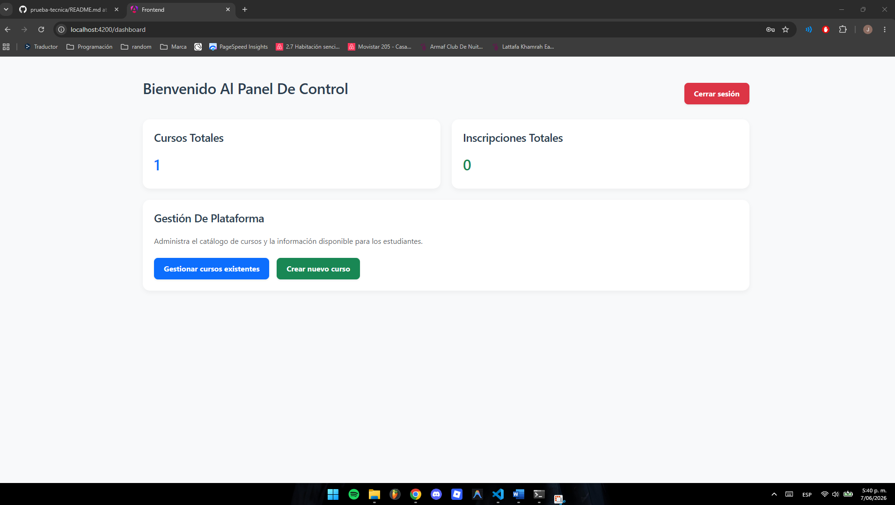
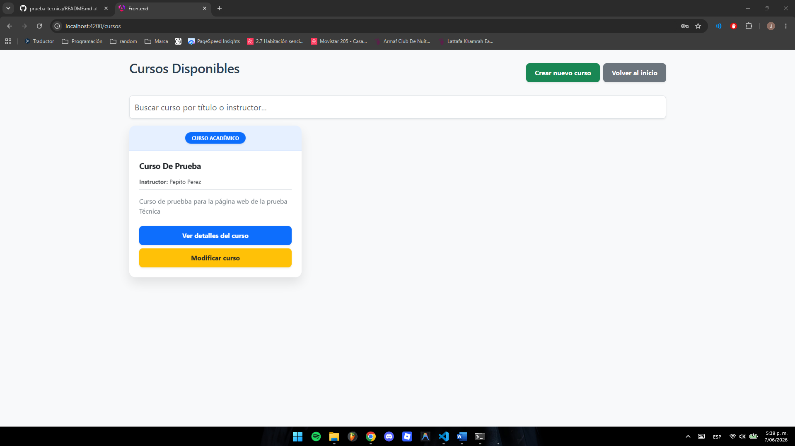
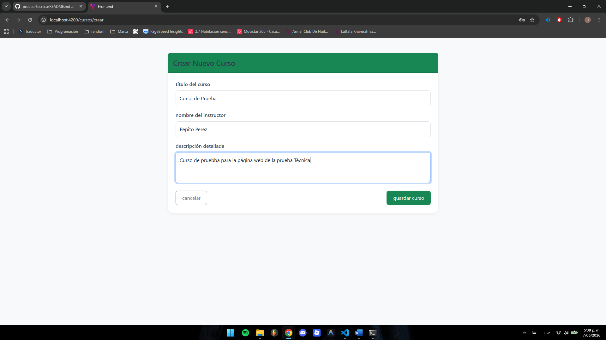
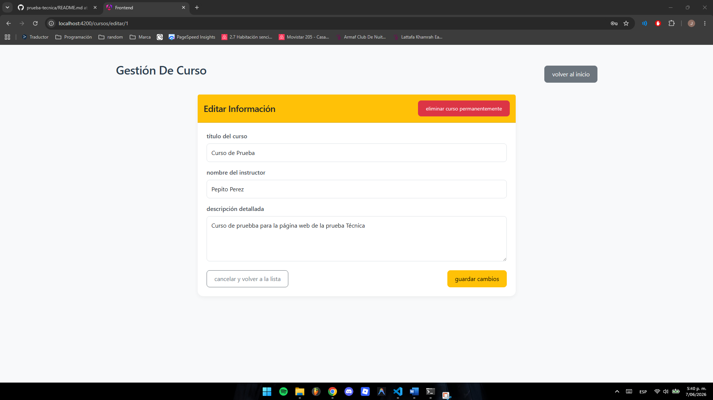
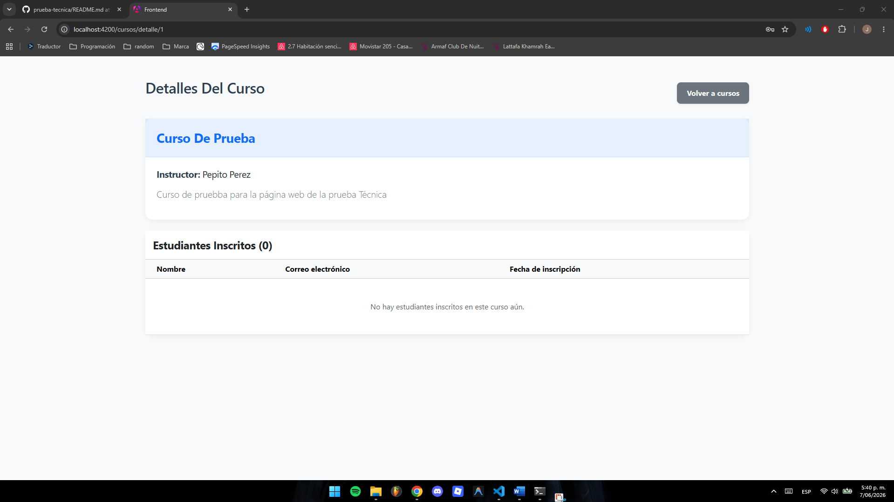
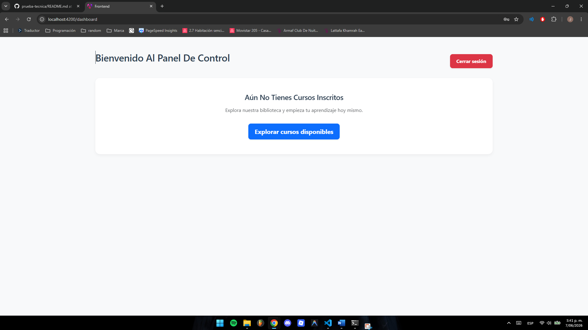
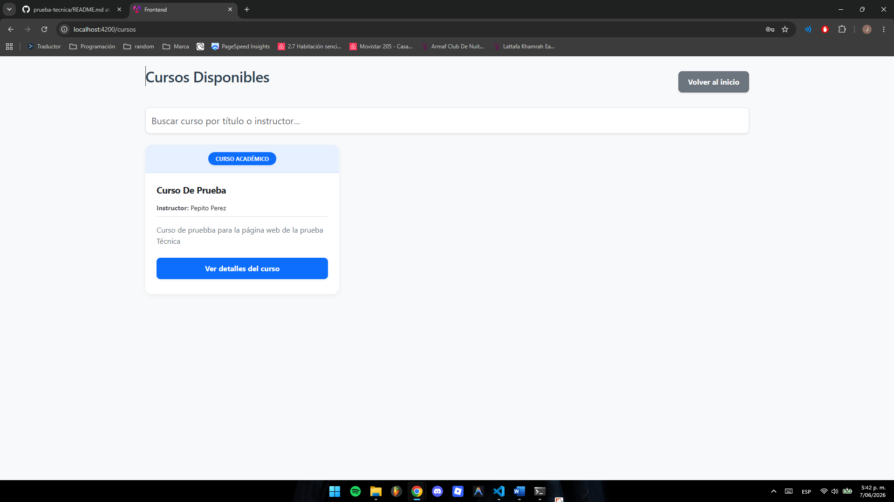
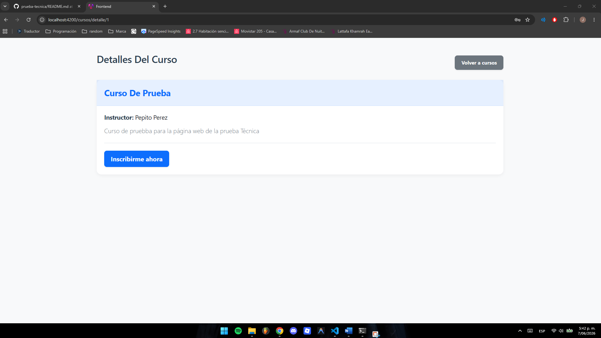
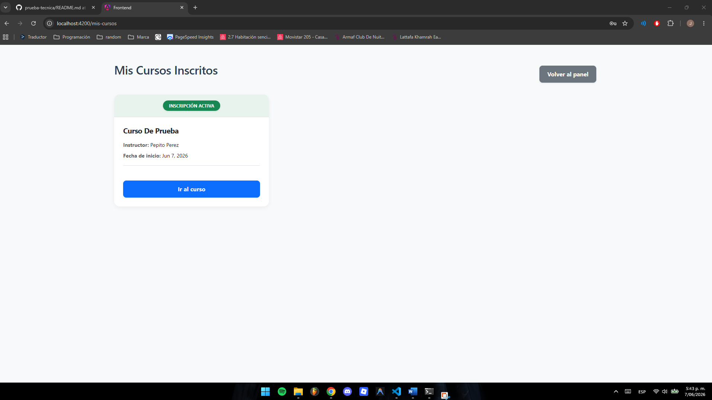

# Plataforma de Cursos Educativos - Prueba Técnica Full Stack

Esta es una solución Full Stack desarrollada para gestionar el catálogo y las inscripciones de una academia virtual. El sistema permite la creación, edición y eliminación de cursos por parte de administradores, así como la exploración, búsqueda y registro en cursos por parte de los estudiantes.

## Tecnologías Utilizadas

* **Frontend:** Angular (Componentes Standalone), Bootstrap 5, RxJS, HTML5, CSS3.
* **Backend:** Flask (Python), Flask-JWT-Extended, SQLAlchemy (ORM).
* **Base de Datos:** SQLite.
* **Autenticación:** JWT (JSON Web Tokens).

## Puntos Extra Implementados (Plus)

Se han cubierto requerimientos más allá de las historias de usuario básicas para asegurar un producto robusto y escalable:

1. **Gestión de Roles (RBAC):** Interfaces, componentes y accesos a la API estrictamente separados entre "Administrador" y "Estudiante".
2. **Buscador en Tiempo Real:** Filtro reactivo en el frontend para buscar cursos por título o instructor sin necesidad de recargar la página ni hacer peticiones extra al servidor.
3. **Manejo de Estados Vacíos (Empty States):** UI/UX mejorada que guía al usuario cuando no tiene cursos inscritos o cuando no hay resultados de búsqueda.
4. **Arquitectura UI/UX Defensiva y Reactiva:** Uso de `ChangeDetectorRef` para actualizaciones instantáneas del DOM y programación defensiva para parseo seguro de respuestas HTTP.
5. **Vista de Detalles Avanzada:** * **Para Estudiantes:** Prevención de doble inscripción y visualización del progreso.
   * **Para Administradores:** Tabla dinámica con el listado de todos los estudiantes inscritos por curso.

## Notas Importantes

* **Acceso de Administrador (Atajo de Evaluación):** Para facilitar la revisión de las vistas de creación y edición sin necesidad de manipular la base de datos manualmente, la lógica de registro asigna automáticamente el rol de `admin` a cualquier cuenta nueva cuyo correo electrónico contenga la palabra **"admin"** (ej. `admin@prueba.com`). Cualquier otro correo será registrado como `estudiante`.
* **Pruebas Unitarias:** Los archivos `.spec.ts` generados por defecto por Angular fueron omitidos/comentados para priorizar el desarrollo de las funcionalidades extra, la arquitectura de roles y el pulido de la interfaz gráfica dentro del tiempo establecido.

## Instrucciones de Instalación y Ejecución Local

### 1. Configuración del Backend (Flask)

Abra una terminal y ubíquese en el directorio del backend:

    cd backend

Cree y active un entorno virtual:

    # En Windows:
    python -m venv venv
    venv\Scripts\activate

    # En Linux/Mac:
    python3 -m venv venv
    source venv/bin/activate

Instale las dependencias del proyecto:

    pip install -r requirements.txt

Inicialice y ejecute la aplicación (la base de datos SQLite se creará automáticamente gracias a SQLAlchemy):

    flask run

El servidor backend estará escuchando en `http://127.0.0.1:5000`.

### 2. Configuración del Frontend (Angular)

Abra una nueva terminal y ubíquese en el directorio del frontend:

    cd frontend

Instale las dependencias de Node.js:

    npm install

Levante el servidor de desarrollo de Angular:

    ng serve

La aplicación web estará disponible en su navegador en `http://localhost:4200`.

## Evidencia de Ejecución

A continuación se adjuntan las capturas de pantalla que demuestran el funcionamiento de la aplicación:

### Vistas de Administrador

### Vistas de Estudiante (Usuario)

## Resumen de Endpoints REST (API)

### Autenticación
* `POST /api/auth/login` - Genera el token JWT.
* `POST /api/auth/registro` - Crea un nuevo usuario.

### Cursos (Público / Estudiantes)
* `GET /api/cursos` - Lista todos los cursos.
* `GET /api/cursos/<id>` - Detalles de un curso específico.
* `POST /api/cursos/<id>/inscribirse` - Registra al estudiante autenticado en un curso.
* `GET /api/mis-cursos` - Lista los cursos del estudiante autenticado.

### Gestión de Cursos (Solo Administradores)
* `POST /api/cursos` - Crea un nuevo curso.
* `PUT /api/cursos/<id>` - Actualiza un curso existente.
* `DELETE /api/cursos/<id>` - Elimina un curso.
* `GET /api/cursos/<id>/estudiantes` - Lista los alumnos inscritos en un curso específico.
* `GET /api/admin/stats` - Obtiene estadísticas globales de la plataforma.
